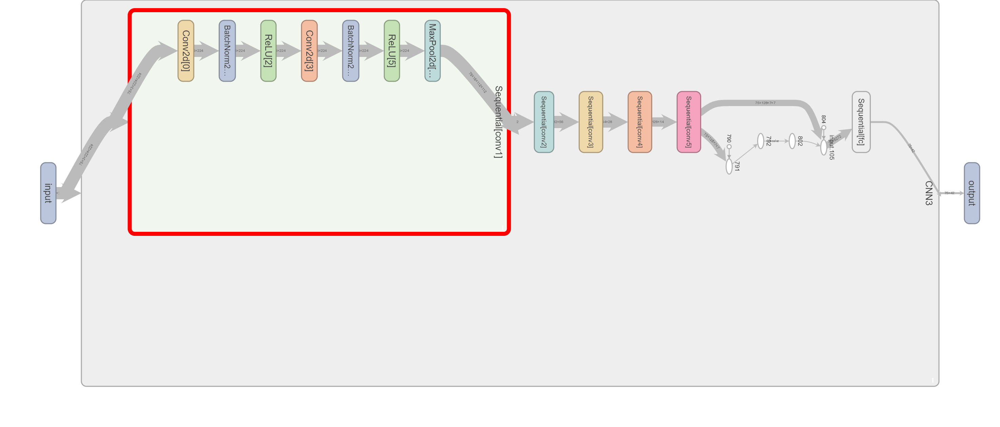
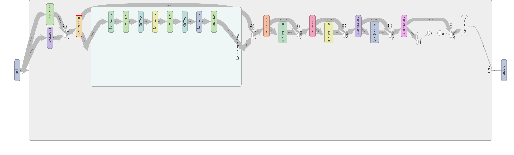
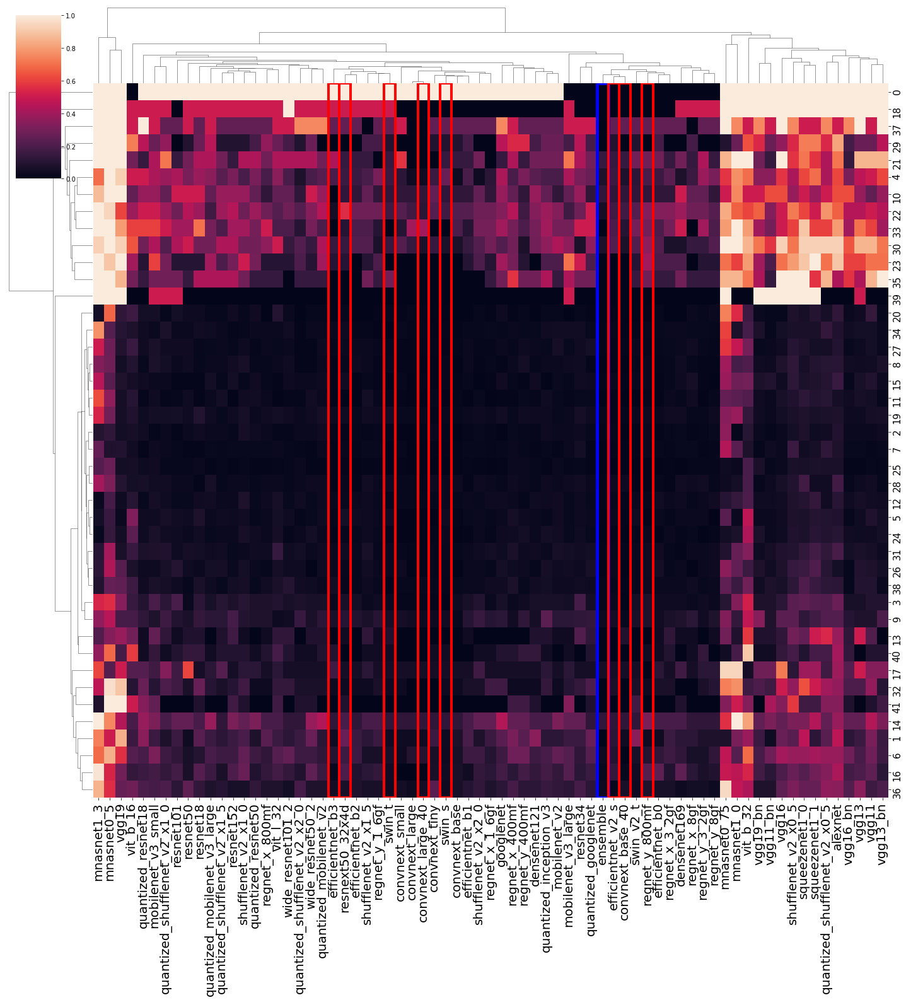
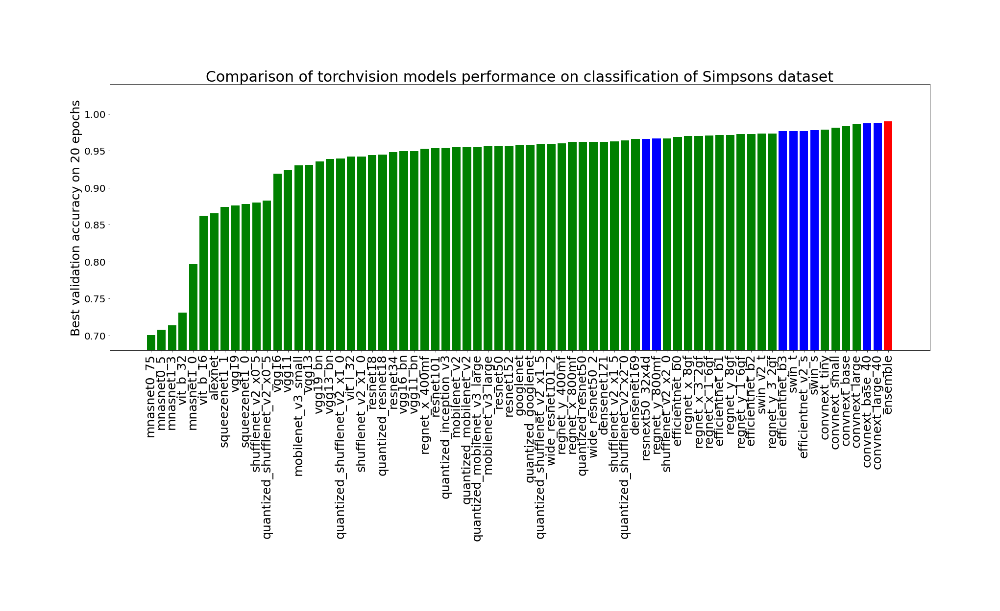

# Project Name
This project trains several models, applies a greedy algorithm for model selection, calculates weights of every model prediction, and finally assembles models to ensemble.

## Instalation 

The requirements for this project are specified in the environment.yml file.

## Usage
To use this project, run the following command:
```bash
train_init.py [-h] [--models MODELS [MODELS ...]] [--batch_size BATCH_SIZE] [--epochs EPOCHS] [--submit SUBMIT]

```
Use the following options:

--models: list of models from the list of models. The full list of models can be found in the CSV file.
--batch_size: the size of batch during training and validation.
--epochs: the number of epochs for training every neural network.
--submit: if non-zero, then a file for submission will be created.


The full list of model could be found [in csv file](lib/models/models_names.csv)

To choose specific models, simply indicate their numbers as an argument to the script. The necessary training parameters and the script will then automatically train the selected models, collect them into an ensemble, and generate predictions.
## Demo

Could be checked [GIF file](pics/demo.gif) with demo

## Explonation of results

Once the model is selected, the script trains every available model and stores the best one. 
Next, it evaluates and clusters the prediction models' results. 
A greedy algorithm is applied to select the minimal number of models with the best performance. 
The model chosen for the ensemble is marked in red on the picture with clusters, and the ensemble itself is marked in blue.

# RESULTS
It was writing two models: simple convolutional cnn3 and with skip connections cnn4. 

The structure is illustrated here


<br>


The effectiveness of the models has been enhanced, achieving an accuracy of approximately 0.95 on the validation dataset. 
Furthermore, 68 models from the [list](lib/models/models_names.csv) underwent training for 20 epochs each. 
The top 2 performing models were trained for an additional 20 epochs. Subsequently, a selection of 8 models was made. 
Information regarding the classification errors can be found as well.

In the image, the percentage of incorrectly classified pictures is displayed. 
Each row represents a class, while each column corresponds to a specific model. 
Red borders denote the models chosen for the ensemble, and blue borders highlight the ensemble's overall performance.



The accuracy of all model are on picture. The blue for selected and red for ensemble


